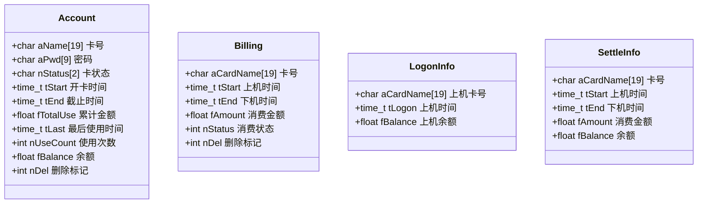
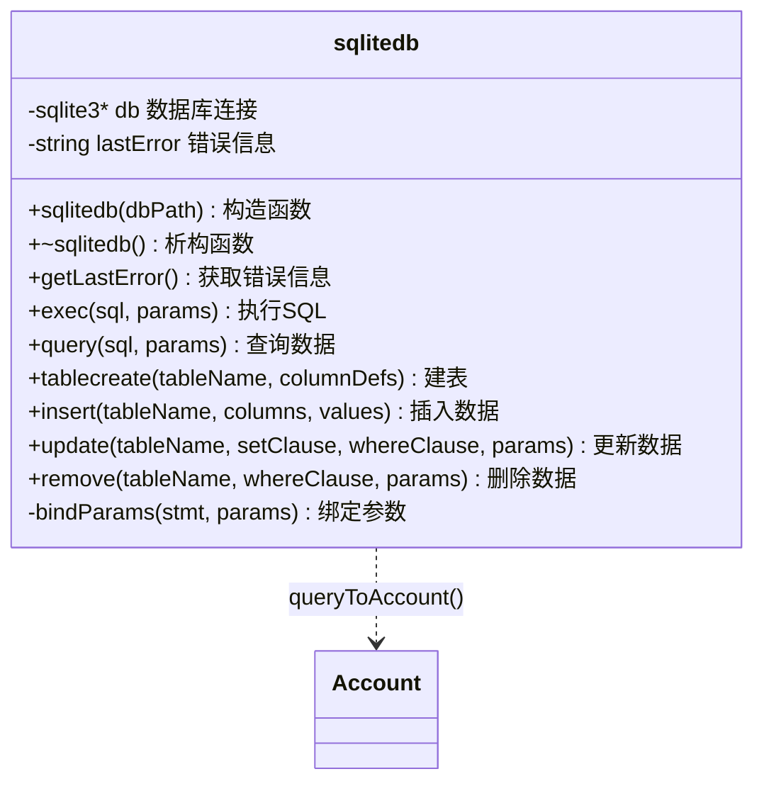
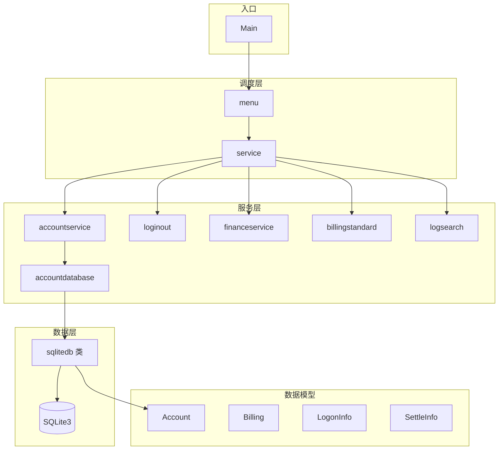

# 计费管理系统

- *(注意：这里面的主分支名为master而非main)，用于习惯新操作*
- 可执行文件地址：./build/bin/AccountManager.exe

- 头文件将参与编译，如多次调用则会编译慢速。
- 条件编译机制 #ifndef #define #endif

- 上传平台：origin
```bash
git push -u gitee master
git push -u github master
```
- 项目运行方式：run.bat , 控制台：`run`

## 前序安排
- 使用compile.bat快速编译，即注意在cmd终端里面编译和运行。

## 需求分析
- 设计计费基于控制台交互的管理系统，包含三个主要需求
    - 1. 基于卡号的用户管理制度
    - 2. 用户有关数据管理
    - 3. 上下机活动和结算

## CLI菜单设计
- 封装函数。
- 一个菜单不超过6项，通常为5项，编号不超过5
> 心理学中的 “米勒定律”（Miller's Law），即人类的工作记忆容量大约为 7±2 个组块。这一原则常被引申到用户界面设计中，建议菜单或导航的选项数量控制在 5～9 项 以内，以避免用户因信息过载而产生认知负担。

## 项目设计
### 功能设计

### 项目结构
```
accountmanagement/
├── src/                            # 源代码目录
│   ├── Main.cpp                    # 程序入口
│   ├── menu.cpp                    # 菜单模块实现
│   ├── service.cpp                 # 服务调度实现
│   ├── tool.cpp                    # 工具函数实现
│   ├── database.cpp                # 数据库基础操作实现
│   ├── services/                   # 业务服务模块
│   │   ├── accountservice.cpp      # 账户服务实现
│   │   ├── accountdatabase.cpp     # 账户数据库操作实现
│   │   ├── billingstandard.cpp     # 计费标准服务实现
│   │   ├── financeservice.cpp      # 财务服务实现
│   │   ├── loginout.cpp            # 上下机服务实现
│   │   └── logsearch.cpp           # 日志查询服务实现
│   └── sqlite3/                    # SQLite3 嵌入式数据库
│       ├── sqlite3.c
│       ├── sqlite3.h
│       ├── sqlite3ext.h
│       └── shell.c
├── include/                        # 头文件目录
│   ├── menu.h                      # 菜单接口
│   ├── service.h                   # 服务调度接口
│   ├── tool.h                      # 工具函数接口
│   ├── global.h                    # 全局变量和常量
│   ├── model.h                     # 数据结构定义
│   ├── database.h                  # 数据库基础操作接口
│   ├── accountdatabase.h           # 账户数据库操作接口
│   ├── accountservice.h            # 账户服务接口
│   ├── billingstandard.h           # 计费标准服务接口
│   ├── financeservice.h            # 财务服务接口
│   ├── loginout.h                  # 上下机服务接口
│   └── logsearch.h                 # 日志查询服务接口
├── data/                           # 数据存储目录
│   └── account.db                  # 账户数据库文件
├── build/                          # 构建输出目录
│   └── bin/
│       └── AccountManagement.exe   # 可执行文件
├── CMakeLists.txt                  # CMake 构建配置
├── README.md
├── run.bat                         # 运行脚本
└── compile.bat                     # 编译脚本
```

### UML 类图

#### 数据结构定义



#### 数据库封装类



#### 模块依赖关系



#### 模块说明

| 层级 | 模块 | 接口函数 | 功能 |
| --- | --- | --- | --- |
| 入口层 | Main.cpp | `main()` | 程序入口 |
| 菜单层 | menu.cpp/h | `menu()` | 主菜单 |
| 调度层 | service.cpp/h | `service1~5()` | 服务路由：账户/使用/计费/财务/查询 |
| 数据库层 | database.cpp/h | `sqlitedb` 类 | SQLite3 封装 |
| 数据库层 | accountdatabase.cpp/h | `searchaccount()` `changeaccount()` `signup()` `deletecard()` | 账户数据操作 |
| 服务层 | accountservice.cpp/h | `accountmenu()` → `accountsearch()` `accountchange()` `signupaccount()` `deleteaccount()` | 账户管理 |
| 服务层 | loginout.cpp/h | `logmenu()` → `login()` `logout()` | 上下机 |
| 服务层 | billingstandard.cpp/h | `billingmenu()` → `newstandard()` `searchstandard()` `changestandard()` `deletestandard()` | 计费标准 |
| 服务层 | financeservice.cpp/h | `financemenu()` → `topup()` `refund()` `history()` `statistics()` | 财务服务 |
| 服务层 | logsearch.cpp/h | `searchmenu()` → `totalsales()` `uselogs()` `logprint()` | 日志查询 |

### 信息表单（结构体数组设计卡务）
1. 卡务信息

|字段|类型|描述|
| --- | --- | --- |
|aName|string|卡号，不能为空，1~18字符|
|aPwd|string|密码，不能为空|
|nStatus|int|卡状态（0-未上机，1-上机中，2-已注销，3-失效）|
|tStart|time_t|开卡时间|
|tEnd|time_t|截止时间|
|fTotalUse|float|累计金额|
|tLast|time_t|最后使用时间|
|nUseCount|int|使用次数|
|fBalance|float|余额|
|nDel|int|删除标记：0,1|

2. 计费信息

|字段|类型|描述|
| --- | --- | --- |
|aCardName|string|卡号|
|tStart|time_t|上机时间|
|tEnd|time_t|下机时间|
|fAmount|float|金额|
|nStatus|int|卡状态（0-未结算，1-已结算）|
|nDel|int|删除（0,1）|

3. 计费标准信息

|字段|类型|描述|
| --- | --- | --- |
|starttime|time_t|开始时间|
|endtime|time_t|结束时间|
|unit|int|最小计费单元|
|charge|float|计费单元收费|
|ratetype|int|计费类别（0-一般，1-包夜，2-包日，3-月VIP，4-年VIP）|
|del|int|删除标记（0,1）|

4. 充值退费信息

|字段|类型|可为空|描述|
| --- | --- | --- | --- |
|cardName|string|false|卡号|
|operationtime|time_t|true|操作时间|
|operation|int|true|操作类别（0-充值，1-退费）|
|del|int|false|删除标志：0,1|

5. 管理员

|字段|类型|可为空|描述|
| --- | --- | --- | --- |
|name|string|false|用户名|
|pwd|string|true|password|
|privilege|int|false|删除标记：0,1|

6. 上机

|字段|类型|描述|
| --- | --- | --- |
|aCardName|string|上机卡号|
|tLogon|time_t|上机时间|
|fBalance|float|上机余额|

7. 下机

|字段|类型|描述|
| --- | --- | --- |
|aCardName|string|卡号|
|tStart|time_t|上机时间|
|tEnd|time_t|下机时间|
|fAmount|float|消费金额|
|fBalance|float|余额|

## 编译与组织方式改动 2026年3月13日
- 构建方式：CMake
- 编译指令：
    - 初步设置：cmake -S . -B build -G "MinGW Makefiles"
    - 编译：cmake --build build
- 相关文件：CMakeLists.txt
- 生成目录：build

## 数据库详情
- 存储位置：data文件夹
- 对接方式：sqlite3
- 数据库名：
    - account.db - 账户
    - standard.db - 计费标准
    - bills.db - 账单
    - logs.db - 记录（按照年月分表）

## 其他预设
- 第一个用户账号：
    - username: 10000000
    - password: 11111111